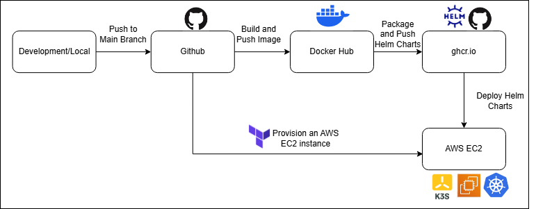

# Kubernetes Deployment for the batch-processing-bbc-infra project

This project uses Kubernetes and Helm to deploy the application that replaces Docker Compose in the ```batch-processing-bbc-infra``` project

#### Project Structure and Context

- Main App Repo: ```batch-processing-bbc```
    - Automates the extraction, processing, and visualization of BBC news headlines
- Infrastructure Repo: ```batch-processing-bbc-infra````
    - Provisions AWS infrastructure and automates deployment using Terraform + GitHub Actions
- Kubernetes Repo: ```batch-processing-bbc-infra-kubernetes``` (this repository)
    - Deploys the app to Kubernetes using Helm

Folders Overview
- helm-charts: Helm template files and values.yaml
- deployment_batch: Application files similar to the setup in ```batch-processing-bbc```
- aws_cloud: Terraform files similar to ```batch-processing-bbc-infra```, with added steps to install k3s on AWS EC2 instance

#### Key Features

- Kubernetes and Helm
    - Kubernetes manifests files for the following resources 
        - Postgres Deployment
        - Streamlit frontend Deployment
        - Cronjob that scapes BBC daily data and saves them in Postgres
        - Services for Postgres and Streamlit deployment 
    - Helm is used to package and manage the Kubernetes resources. The helm package (helm-charts folder) is published to GitHub Container Registry (ghcr) via Github actions 

- CI/CD Deployment Pipeline (Github Actions)
    - The pipeline contains 4 tasks
        - Provision AWS resources through Terraform
        - Build and push Docker images to Docker Hub
        - Package and push Helm charts to ghcr
        - Deploy Helm charts on the AWS EC2 instance's K3s cluster 



#### Running the project

- Configure the following Github secrets for automated deployment

| Name                    | Description                                         |
|-------------------------|-----------------------------------------------------|
| `DOCKER_USER`           | Docker Hub username                                 |
| `DOCKER_PASSWORD`       | Docker Hub password or access token                 |
| `AWS_ACCESS_KEY_ID`     | AWS access key for Terraform access                 |
| `AWS_SECRET_ACCESS_KEY` | AWS secret access key for Terraform access          |
| `AWS_SSH_PRIVATE_KEY`   | Base64-encoded private SSH key for EC2 access       |

- Update the configuration files located at
    - ```./helm-charts/values.yaml``` 
    - ```./aws_cloud/terraform.tfvars```

- To view the dashboard, go to ```http://<your-ec2-public-ip>:30501```


